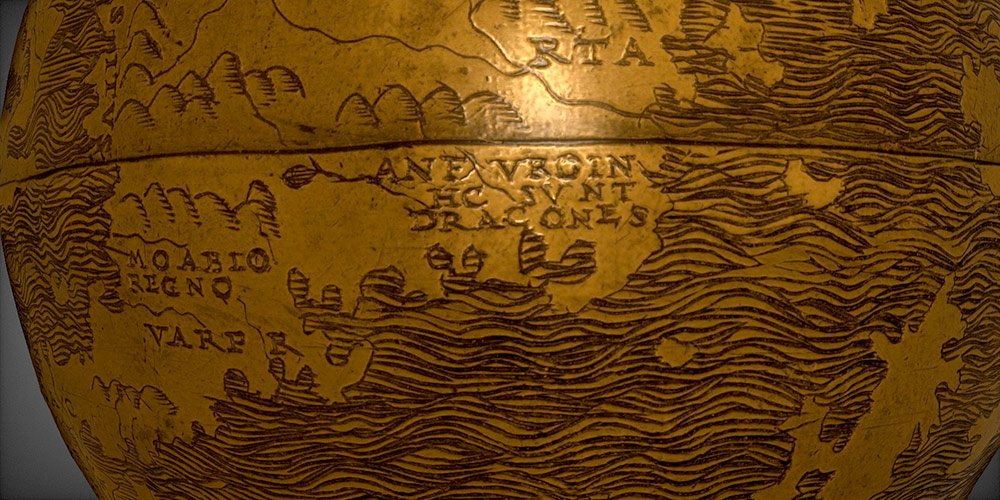

# Beyond this Point Be Dragons

## Origin

It seems that the fact that old maps contain indications like "here be dragons" is more a legend than a real fact. Indeed, only one globe has this indication : the [Hunt-Lenox Globe](https://en.wikipedia.org/wiki/Hunt–Lenox_Globe)).

The complete latin text on the mention is *an furo in / hc sunt / dracones* that could be translated by *Are there furious dragons here?* instead of *Here be dragons* which is the translation of only half of the text.

## Who wrote the Dalluhn manuscript?

Difficult to say. The percentages lead towards Dave Arneson but it is a manuscript that is dated in the period Dave and Gary (Gygax) were exchanging drafts for OD&D. It seems however that Gary never saw this manuscript, and that some parts are very similar to the works of Dave Arneson (see the *DaveArneson* folder in this repo). So, who knows.

See the study from Jon Peterson, probably the most detailed analysis of this manuscript.

